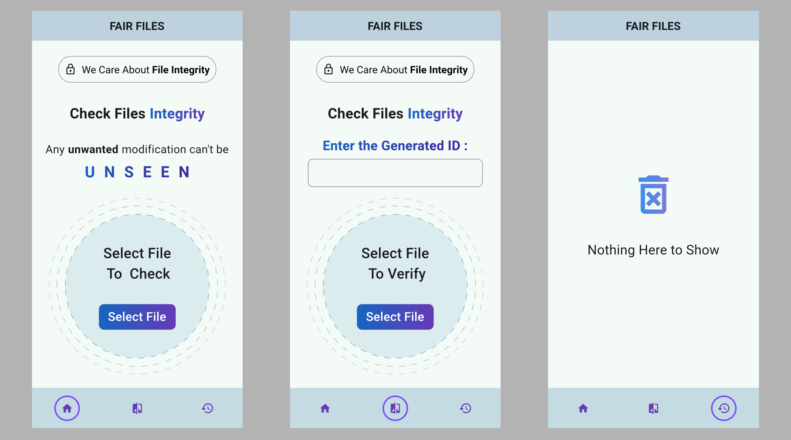

# Fair Files
A FIC (File Integrity Checker) App for checking the Integrity of a file and tells the user if the file content has been modified or not. 
## Screenshots



<!-- ## Overview

- **Optimized State Management**: *Flutter Bloc* is used for optimized state management of the app. 

- **User Friendly UI**: Clean and intuitive User Interface(UI), different status releted messages for better user experience. -->

## Getting Started

To test this FIC(File Integrity Checker) App, follow these steps:

1. **Clone the Repository**: Clone this repository to your local machine using Git.
```
    $ git clone https://github.com/ayato91/Fair-Files.git
```

2. **Set Up Your Flutter Environment**: Ensure you have Flutter and Dart installed on your development machine. Follow the [Flutter installation guide](https://flutter.dev/docs/get-started/install) for detailed instructions.

3. **Install Dependencies**: Navigate to the project directory and run the following command to install the app's dependencies:
```
    $ flutter pub get 
```

4. **Run the App**: Launch the app on an emulator or physical device by running the following command:
```
    $ flutter run
```

5. **Start Exploring**: Select a file to generate a unique ID. Use the ID along with the file to check the integrity of that file.


## Dependencies

The app relies on several Flutter packages and libraries, including:

- [flutter_bloc](https://pub.dev/packages/flutter_bloc) for state management of the app.
- [file_picker](https://pub.dev/packages/file_picker) for select and pick the file.
- [http](https://pub.dev/packages/http) for fetch and post data to the backend server.


For adding any package:
```
    $ flutter pub add package_name
```

You can find the complete list of dependencies in the `pubspec.yaml` file. Follow the [pub.dev](https://pub.dev) for more dependencies.


Thank You!
